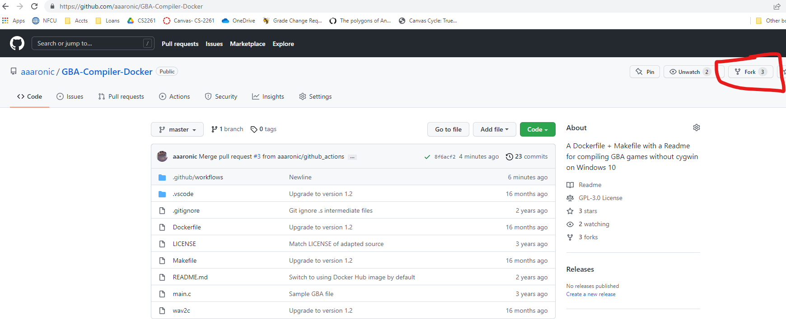
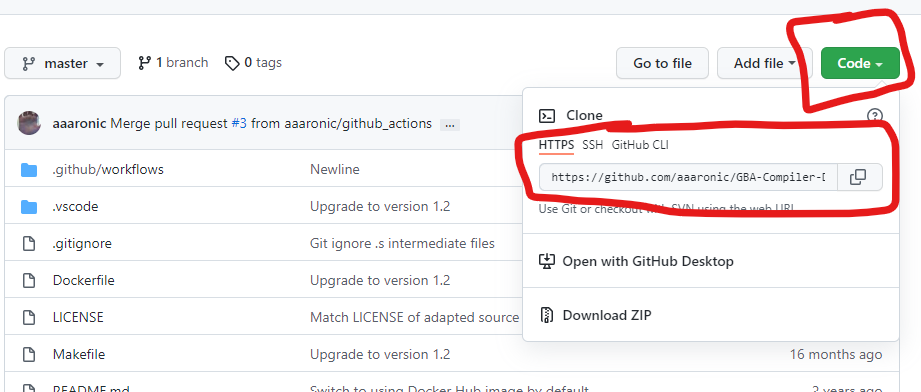
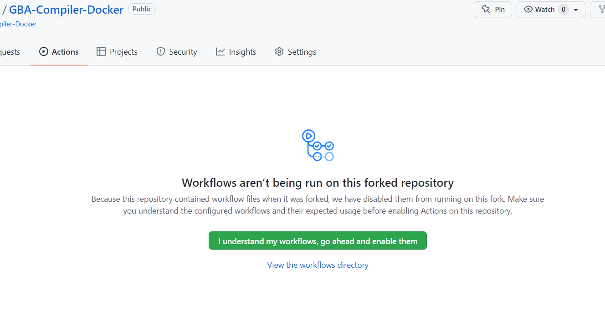
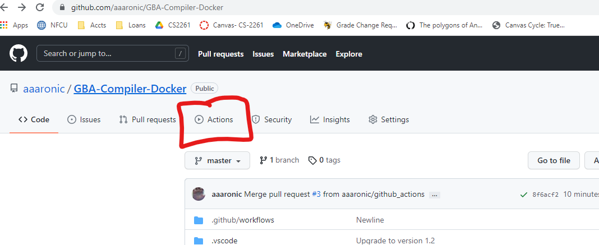
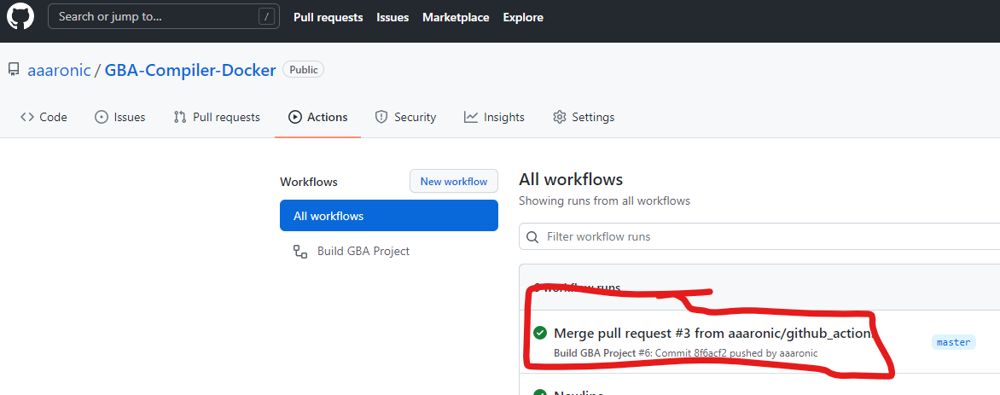
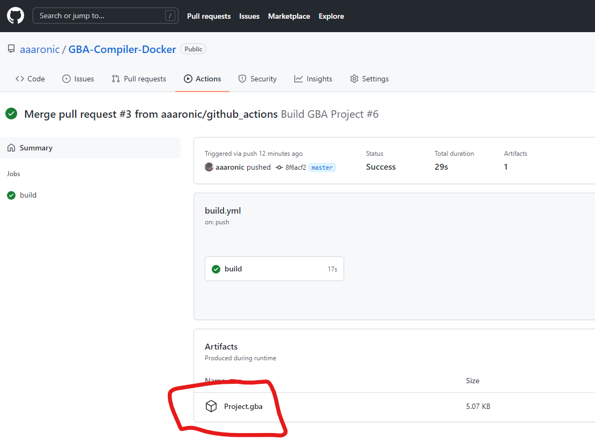
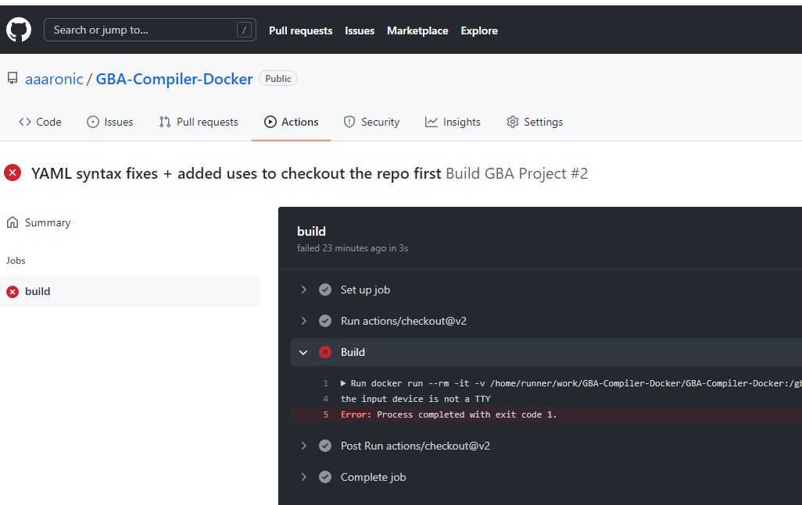

# Using this repo to perform GitHub actions builds of a GBA project:

## Purpose
If for some reason you are unable to run docker locally, this repository can be forked to enable you to perform project builds using GitHub actions.

# Setup
Step one is creating a GitHub account, if you don't already have one (https://github.com/join).

Once you have a GitHub account, go to main page of this repo and click the “Fork” button https://github.com/aaaronic/GBA-Compiler-Docker

Once you have your own Fork (independent copy of the repository), you should clone your new repo, so you have a local working copy:

You’ll use that string to clone the repo locally. If using the command-line version of git, that would be a simple `git clone https://github.com/YourGithubUserName/GBA-Compiler-Docker.git` (your URL will be to your fork, not my original).

Note: There is a GitHub desktop application that might make the cloning/committing easier -- I personally just use the command line interface (CLI) because that's what I'm used to.

You need to enable workflows on the Actions tab of your fork. You should _not need to create a Pull Request_ (PR) to get the Action to run on each push to the main/master branch.

## Usage
The build from there is actually pretty simple (CLI instructions):
- Add your project's .c and .h files to the base folder of the repository (and remove the placeholder main.c in there)
  - Commit all the .c/.h files:
    - git add *.c *.h
    - git commit -m “Some text here to say what you’re doing”
  - git push  # this sends your changes back to GitHub
- GitHub will then notice the changes and automatically trigger a build under “Actions”:
  
- When the build finishes, if it succeeded, you’ll be able to download the Project.gba created:
  
  
  
- If the build fails, you can see the failure message docker would have given you locally:
